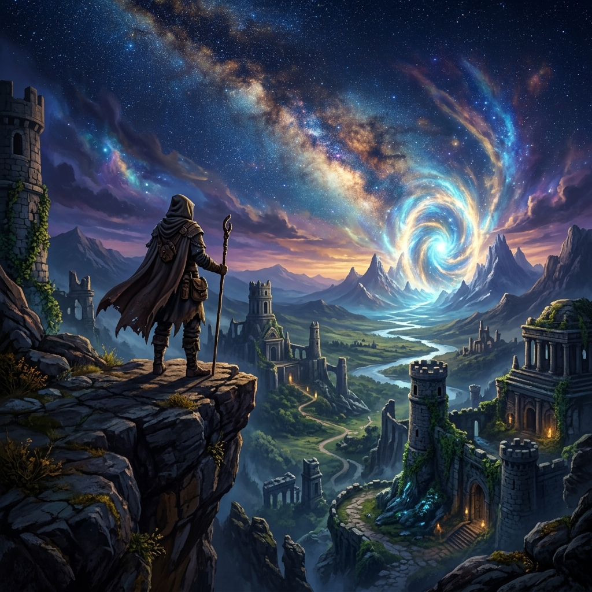
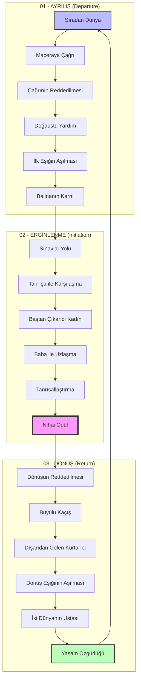

  

# 🗡️ Maceraya Çağrı (The Call to Adventure)

> *"Mağaraya girmekten korktuğun yer, aradığın hazineyi saklar."* — Joseph Campbell

**Maceraya Çağrı**, Joseph Campbell'ın kült eseri *Kahramanın Sonsuz Yolculuğu'nda (The Hero with a Thousand Faces)* ortaya koyduğu **"Monomit" (Tek Mit)** kavramını derinlemesine inceleyen, analiz eden ve modern hikaye anlatıcıları için pratik bir başvuru kaynağına dönüştüren kapsamlı bir açık kaynak deposudur.

İnsanlık tarihi boyunca anlatılan efsanelerden modern sinema başyapıtlarına, çok satan romanlardan epik video oyunlarına kadar hemen her büyük hikaye aynı iskeleti paylaşır. Bu repo, o kadim iskeletin anatomisini çıkarmak için oluşturulmuştur.

---

## 📖 İçindekiler

1. [Projenin Amacı](#-projenin-amacı)
2. [Monomit Nedir?](#-monomit-nedir)
3. [Klasör Yapısı ve Yolculuğun Aşamaları](#-klasör-yapısı-ve-yolculuğun-aşamalari)
4. [Monomit Döngüsü (Görselleştirme)](#-monomit-döngüsü-görselleştirme)
5. [Temel Arketipler](#-temel-arketipler)
6. [Temel Kaynakça ve Okuma Listesi](#-temel-kaynakça-ve-okuma-listesi)
7. [Bu Repo Kimler İçin?](#-bu-repo-kimler-için)
8. [Sıkça Sorulan Sorular (SSS)](#-sıkça-sorulan-sorular-sss)
9. [Nasıl Kullanılır?](#-nasıl-kullanılır)
10. [Katkıda Bulunma](#-katkıda-bulunma)
11. [Lisans](#-lisans)

---

## 🎯 Projenin Amacı

Bu deponun temel amacı, Monomit teorisini sadece akademik bir okuma olmaktan çıkarıp, **uygulanabilir bir tasarım ve yazım iskeleti** haline getirmektir. İster bir roman yazıyor olun, ister bir masaüstü rol yapma oyunu (FRP) kurguluyor olun, buradaki dökümanlar hikayenizin tıkandığı yerlerde size bir pusula olmayı hedefler.

## 🏛️ Monomit Nedir?

Monomit, dünyadaki tüm mitolojik anlatıların, masalların ve destanların aslında temel bir yapının varyasyonları olduğu teorisidir. Kahraman sıradan dünyasından ayrılır, doğaüstü bir alana girer, efsanevi güçlerle yüzleşip kesin bir zafer kazanır ve macerasından, edindiği güç veya bilgiyle yoldaşlarına fayda sağlamak üzere geri döner.

---

## 📂 Klasör Yapısı ve Yolculuğun Aşamaları

Bu repo, Campbell'ın belirlediği ana yapıya sadık kalarak **3 ana perde** ve **17 alt aşama** şeklinde klasörlendirilmiştir. Her bir klasörün içinde o aşamanın psikolojik alt metni, yazım teknikleri ve ünlü eserlerden (Star Wars, Matrix, Yüzüklerin Efendisi, Gılgamış) vaka analizleri bulunur.

### 📁 01_Ayrilis (Departure)
Kahramanın sıradan dünyasından kopup bilinmeyene doğru yola çıktığı aşamadır.
*   `01-Sıradan-Dunya.md`: Hikayenin başlangıç noktası ve statüko.
*   `02-Maceraya-Cagri.md`: Dengeyi bozan ve kahramanı harekete geçmeye zorlayan o ilk kıvılcım.
*   `03-Cagrinin-Reddedilmesi.md`: Korku, güvensizlik veya sorumluluklar nedeniyle kahramanın tereddütü.
*   `04-Dogaustu-Yardim.md`: Genellikle bilge bir figürün (Mentor) kahramana rehberlik etmesi veya büyülü bir nesne vermesi.
*   `05-Ilk-Esigin-Asilmasi.md`: Geri dönüşü olmayan nokta. Bilinen dünyanın kurallarının bittiği yer.
*   `06-Balinanin-Karni.md`: Kahramanın eski benliğinin ölümü ve yenilenme sürecine girişi.

### 📁 02_Erginlenme (Initiation)
Kahramanın bilinmeyen dünyada test edildiği, dönüştüğü ve asıl amacına ulaştığı aşamadır.
*   `07-Sinavlar-Yolu.md`: Kahramanın sınandığı, dost ve düşman edindiği süreç.
*   `08-Tanrica-ile-Karsilasma.md`: Kahramanın evrensel sevgi veya nihai yaratıcı güç ile yüzleşmesi.
*   `09-Bastan-Cikarici-Kadin.md`: Kahramanı asıl amacından saptırabilecek maddi veya bedensel ayartmalar.
*   `10-Baba-ile-Uzlasma.md`: Kahramanın hayatı üzerindeki nihai otorite figürüyle yüzleşmesi ve onu aşması.
*   `11-Tanrilastirma.md`: Fiziksel sınırların ötesine geçiş ve tam bir aydınlanma hali.
*   `12-Nihai-Odul.md`: Maceranın asıl amacı olan "İksir", "Kutsal Kase" veya nihai bilginin elde edilmesi.

### 📁 03_Donus (Return)
Kahramanın kazandığı güç veya bilgiyle sıradan dünyaya dönme ve onu iyileştirme çabasıdır.
*   `13-Donusun-Reddedilmesi.md`: Kahramanın aydınlandığı dünyada kalmak isteyip geri dönmek istememesi.
*   `14-Buyulu-Kacis.md`: Ödülü koruyan güçlerin kahramanı engellemeye çalışması ve heyecanlı bir kaçış.
*   `15-Disaridan-Gelen-Kurtarici.md`: Dönüş yolunda tükenen kahramana dış dünyadan bir elin uzanması.
*   `16-Donus-Esiginin-Asilmasi.md`: Yeni kazanılan bilgeliğin sıradan dünyada uygulanabilir hale getirilmesi.
*   `17-Iki-Dunyanin-Ustasi.md`: Kahramanın hem maddi hem ruhani dünya ile barışık hale gelmesi.
*   `18-Yasam-Ozgurlugu.md`: Ölüm korkusunun aşılması ve anı yaşama özgürlüğü.

---

## 🎭 Temel Arketipler

Yolculuk sadece mekanlardan ve olaylardan ibaret değildir; aynı zamanda psikolojik derinliği olan figürlerle doludur. `📁 Arketipler` dizininde Carl Jung'un psikolojisinden beslenen şu temel karakter yapıları incelenmektedir:
*   **Kahraman (The Hero):** Fedakarlık yapan, değişimi başlatan.
*   **Mentor (The Mentor):** Bilge rehber, eğiten ve donatan.
*   **Eşik Bekçisi (Threshold Guardian):** Kahramanın kararlılığını test eden engeller.
*   **Haberci (The Herald):** Maceraya çağrıyı getiren güç.
*   **Şekil Değiştiren (Shapeshifter):** Sadakati belirsiz, hikayeye şüphe katan figür.
*   **Gölge (The Shadow):** Kahramanın karanlık yansıması, ana düşman.
*   **Düzenbaz (The Trickster):** Mizah katan, statükoyu sarsan figür.

---

## 🛠️ Bu Repo Kimler İçin?

*   **Yazarlar ve Senaristler:** Tıkanıklık (Writer's block) yaşadıklarında hikayenin bir sonraki adımını öngörebilmek için.
*   **Oyun Geliştiricileri (Game Designers):** Oyuncunun hissedeceği ilerleme hissini ve bölüm tasarımlarını epik bir yapıya oturtmak için.
*   **Mitologlar ve Edebiyat Öğrencileri:** Klasik metinleri veya popüler kültür ürünlerini yapısalcı bir yaklaşımla analiz etmek için.
*   **Masaüstü RYO (TTRPG) Oyun Yöneticileri (GM/DM):** Kampanyalarını daha unutulmaz ve bütüncül bir yapıda kurgulamak için.

---

## 🚀 Nasıl Kullanılır?

1. Repoyu bilgisayarınıza klonlayın veya doğrudan GitHub/GitLab üzerinden tarayın.
2. Yazım sürecindeyseniz, hikayenizin bulunduğu mevcut aşamanın dokümanını (Örn: `07-Sinavlar-Yolu.md`) okuyarak bu aşamada olması gereken kırılma noktalarını inceleyin.
3. `Vaka-Calismalari` klasöründeki analizleri okuyarak, Monomit'in usta işi eserlerde nasıl başarıyla esnetildiğini (veya kuralların nasıl zekice yıkıldığını) gözlemleyin.

---

## 🔄 Monomit Döngüsü (Görselleştirme)

Kahramanın yolculuğu doğrusal değil, döngüsel bir süreçtir. Aşağıdaki şema, bu yolculuğun ana duraklarını özetler:

---

## 📚 Temel Kaynakça ve Okuma Listesi

Monomit ve hikaye yapısı üzerine daha derinlemesine bilgi edinmek için şu eserleri inceleyebilirsiniz:

1.  **Joseph Campbell** - *Kahramanın Sonsuz Yolculuğu (The Hero with a Thousand Faces)*: Teorisinin temeli.
2.  **Christopher Vogler** - *Yazarın Yolculuğu (The Writer's Journey)*: Campbell'ın teorisini modern senaryo yazımı için modernize eden rehber.
3.  **Carl G. Jung** - *Arketipler ve Kolektif Bilinçaltı*: Arketiplerin psikolojik kökenleri.
4.  **Vladimir Propp** - *Masalın Morfolojisi*: Hikaye yapısı üzerine yapısalcı bir diğer temel eser.

---

## ❓ Sıkça Sorulan Sorular (SSS)

**S: Her hikaye bu 17 aşamanın hepsini içermek zorunda mı?**  
C: Hayır. Campbell'ın kendisi de bu aşamaların her hikayede farklı kombinasyonlarda bulunabileceğini belirtir. Bazı hikayeler bazı aşamaları atlar, bazılarını ise birleştirir. Önemli olan temel ruhun korunmasıdır.

**S: Monomit sadece "erkek" kahramanlar için mi geçerlidir?**  
C: Teorinin dili tarihsel nedenlerle eril görünse de, Monomit evrensel bir insan gelişim sürecini anlatır. Günümüzde "Kahramanın Yolculuğu" cinsiyetten bağımsız olarak tüm karakter gelişim süreçlerine başarıyla uygulanmaktadır.

**S: Bu yapıyı kullanmak hikayeyi klişe yapar mı?**  
C: Hayır. İskelet aynı olsa da, o iskeletin üzerine giydirdiğiniz et (karakterler, dünya tasarımı, diyaloglar) tamamen size özgüdür. Monomit bir kısıtlama değil, bir pusuladır.

---

## 🗺️ Proje Yol Haritası

- [x] Temel Monomit yapısının kurulması (17 Aşamalı Klasörleme).
- [x] Temel Arketiplerin (Kahraman, Mentor, vb.) dökümantasyonu.
- [x] Örnek vaka çalışmaları (Matrix, Yüzüklerin Efendisi).
- [ ] Daha fazla modern vaka analizi (Harry Potter, Interstellar, God of War).
- [ ] "Kahramanın Karşı-Yolculuğu" (The Anti-Hero's Journey) bölümü.
- [ ] İnteraktif bir "Hikaye Taslak Oluşturucu" (Story Template) eklenmesi.

---

## 🤝 Katkıda Bulunma

Bu repo yaşayan bir kütüphane olacak şekilde tasarlanmıştır. Katkıda bulunmak çok kolaydır:
1. Repoyu fork'layın.
2. Sevdiğiniz bir film, kitap veya oyunun "Monomit Analizini" `Vaka-Calismalari` dizinine ekleyin.
3. Mevcut çevirileri iyileştirin veya kendi notlarınızı (Pull Request) gönderin.

Ayrıntılı bilgi için [CONTRIBUTING.md](CONTRIBUTING.md) dosyasına göz atın.

---

## 📜 Lisans

Bu proje **MIT Lisansı** ile lisanslanmıştır. Daha fazla bilgi için `LICENSE` dosyasına bakabilirsiniz. İçeriklerin kişisel, akademik veya ticari hikaye projelerinizde (atıf yapmak koşuluyla) kullanılması serbesttir.
